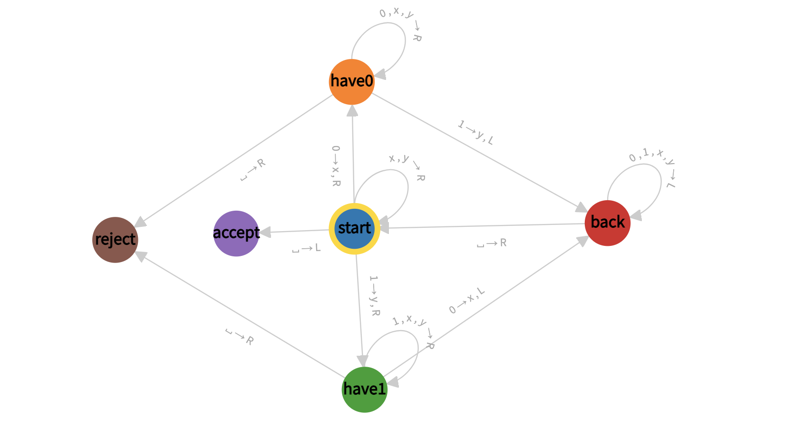
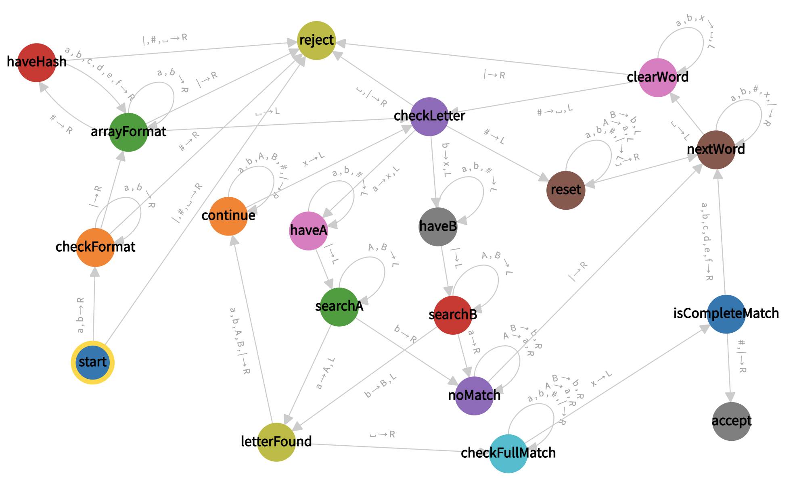
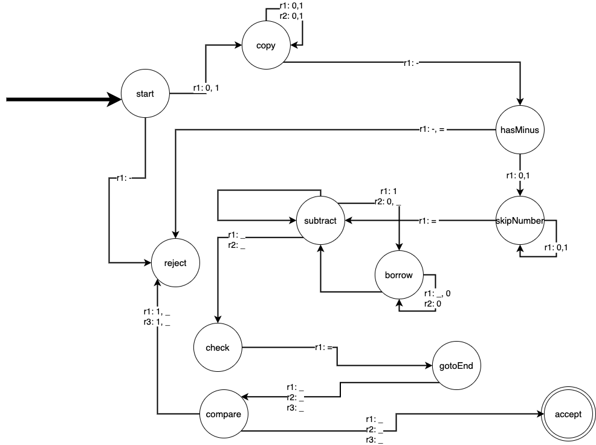
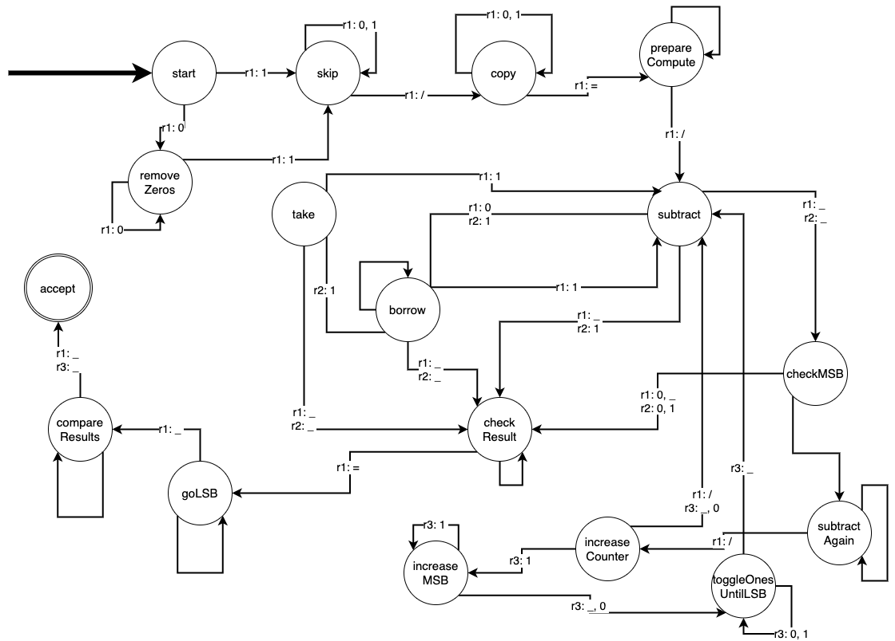

# Theory of Computation  
**Author:** Matteo Ghilardini

---

## Assignment 1
### Problem 1

This Turing Machine operates over the alphabet $\{0,1\}$ and recognizes strings belonging to the language $\{0^n 1^m \lor 1^m 0^n | m=n\}$, meaning it accepts strings that consist of an equal number of `0`s and `1`s.

The machine begins in the `start` state, where it examines the first symbol. If it encounters a $0$, it replaces it with an $x$ and moves right into the `have0` state, indicating that it has started processing a sequence of $0s$ and so is _looking for_ a $1$. Similarly, if it encounters a $1$, it marks it as $y$ and transitions to the `have1` state, signaling the start of a sequence of $1s$ and so is _looking for_ a $0$. If the machine encounters an already marked symbol ($x$ or $y$), it continues moving right to verify the structure of the string. When it reaches a blank space (`' '`), it moves left into the `accept` state, confirming that the input is valid; this makes also the input `' '` string accepted.

In the `have0` state, the machine scans right through $0s$, as well as marked symbols $x$ and $y$. When it encounters a $1$, it marks it as $y$ and moves left to the `back` state to repeat the process. If it reaches a blank space, it means there are more $0s$ than $1s$, leading the machine to reject the input.

The `have1` state operates in a similar way. The machine moves right, passing over $1s$, $xs$, and $ys$. When it encounters a $0$, it marks it as $x$ and moves left to the `back` state. If it reaches a blank space, it indicates that there are more $1s$ than $0s$, causing the machine to reject the input.

The `back` state allows the machine to return leftward, scanning past $0s$, $1s$, $xs$, and $ys$ until it reaches the beginning of the string. If it encounters a blank space, it moves right back into the `start` state, repeating the process until all symbols have been marked.

If all $0s$ and $1s$ have been correctly paired and marked, reaching a blank space leads the machine into the `accept` state, meaning the input is valid. However, if there is an imbalance in the number of $0s$ and $1s$, the machine transitions into the `reject` state.

### Problem 2

This Turing Machine operates over the alphabet $\{a, b, c, d, e, f, \#, |\}$ and decides if a given non-empty string of letters `word` delimited by symbol `|` is present in an array of non-empty letter strings `word_i` separated by the symbol `#`.

**To simplify the graph, I decided to show only the handling of the letters `a` and `b`, but in the attached code all letters `a` through `f` are handled as required by the text of the problem.**

The machine begins in the `start` state, where it verifies the first character is a valid letter (`a` to `f`). If it instead encounters a `#`, `|`, or a blank space, the input is immediately rejected. Upon reading a valid character, the machine transitions to the `checkFormat` state.

In the `checkFormat` state, the machine scans the input for the presence of the `|` separator. If the machine encounters a `#` before the `|`, it rejects the input, as the format is invalid. Once it reaches `|`, it moves into the `arrayFormat` state.

The `arrayFormat` state expects at least one `#` following the `|`, indicating the beginning of the list of candidate words. If this structure is invalid, such as encountering another `|` or an empty list, the machine transitions into the `reject` state. Upon reading a `#`, the machine enters the `haveHash` state. Otherwise if reads a ` `, means that has reached the end of the array, meaning must go in `checkLetter` state.

In the `haveHash` state, the machine scans for the next character, which should begin the first word to be checked. If this character is not a valid letter (i.e. one of `|`, `\#` or ` `), the input is rejected.

From here, the machine enters the checking phase, beginning with the `checkLetter` state. This state is responsible for selecting one unmarked letter (from `a` to `f`) from the original word (before `|`) and marking it as `x`. The machine then transitions to a state like `haveA`, `haveB`, etc., depending on which letter was found. If the current checked letter is a `\#` means that the current candidate has less letters than the original word, and so, go in `reset` state.

The `reset` state simply go left making all capital letter lower case untill ` `; when ` ` is reached, go in `nextWord` state.

In the `haveX` states (where `x` means any valid letter), the machine scans leftward back across the input to the start of the candidate word (after the `|`), looking for the matching letter using `searchX` states. If a match is found, the corresponding letter is capitalized (e.g., `a` becomes `A`), marking it as used, and the machine transitions to `letterFound`. If no match is found, the machine transitions to `noMatch`.

In `letterFound`, if the left side element of the current found letter is a ` `, means that all letters of the original word has been evaluated, and so go in `checkFullMatch` state. Otherwise, means that there are more letter in the original letter that are expected, so go in `continue` state.

The state `continue` simply move the pointer to the right untile a `x` is reached (meaning, untill the last checked letter of the current candidate); when it is the case, enter again `checkLetter` status.

The `checkFullMatch` state resets the letters used in the candidate word (marked with capital letters `A` to `F`) and go right untill an `x` is reached, and at this point enters the `isCompleteMatch` checking status.

In `isCompleteMatch`, if the next-left character is a `#` or the end of the array (i.e. `|`), the machine moves to `accept`, indicating the candidate word matches the original. If more letters remain to be verified, it enters the `nextWord` state.

The `nextWord` and `clearWord` states are responsible for resetting the array by removing all characters related with the current candidate word (the ones evaluated and so marked as `x` and the oters, i.e. all letter `a`-`f`) untill a `\#` is reached and preparing to process the next candidate word. At this point the machine repeats the matching process for the next word in the array.

If when is in `checkLetter` status a ` ` or `|` is reached, it means that the array has been checked entirely without finding a match; this move the machine in `reject` state.

### Problem 3
This Turing Machine operates over the alphabet $\{0,1,-,=\}$ and recognizes strings belonging to the language $\{a-b=c | a,b,c \in \{0,1\}^+ \land c=a-b\}$ meaning it accept strings that contains a correct binary subtraction (where all numbers are non-negative)

**In order not to make the graph incomprehensible, I have reported only the key reading transitions. Where there are no labels to the transitions, it means that _in all other cases, this transition is followed_.**

The machine begins in the `start` state, where it examines the first symbol on tape 1. If it encounters a `0` or a `1`, it transitions to the `copy` state, indicating the beginning of the copying process. It starts by copying the initial number (the left-hand side of the equation) to tape 2, preparing for the later comparison with the result of the subtraction. If it finds a `-` as first character of the string, `reject`.

In the `copy` state, the machine continues scanning right on tape 1, copying digits onto tapes 2 until it reaches the `-` symbol.  

This indicates the transition to the `hasMinus` state, where the machine verifies the presence of the `=` symbol immediately before the `-`. If the format is incorrect (i.e. there is `-` or a `=` right after the previous `-`), the machine enters the `reject` state.

Once the equation format is validated, the machine transitions into the `skipNumber` state. Here, it skips over the second operand (the number right after the `-` sign) to position the tape heads properly for subtraction.

In the `subtract` state, the machine performs bitwise binary subtraction of the second operand (from tape 1) from the first operand (from tape 2), and write the result in tape 3. The empty string `_` is considered the same as `0` an it applies for the following binary subtraction rules:
- `0 - 0 = 0`
- `1 - 0 = 1`
- `1 - 1 = 0`
- `0 - 1` requires borrowing, which triggers a transition into the `borrow` state.

The `borrow` state scans leftward to find the next available `1` in tape 1 to borrow from, flips it to `0`, and adjusts intermediate bits as necessary before returning to continue the subtraction.

Once subtraction is complete (i.e. the heads of tape 1 and 2 reads `_`), the machine enters the `check` state. Tape 1 is cleared untill `=`is reached and at this point the machine transitions into the `gotoEnd` state to prepare for the comparison between tape 1 (with the expected result) and tape 3 (with the computed result).

In `gotoEnd`, the machine aligns the tape heads at the end of the strings, preparing for the final check.

The `compare` state performs a bit-by-bit comparison between the value of `c` (tape 1) and the result of `a-b` (tape 3). If all bits match, the machine transitions into the `accept` state, indicating that the input string is a valid binary subtraction expression. If there is any discrepancy — extra 1-bits (`0` and `_` are neglibible), unequal bits, or improper structure — the machine enters the `reject` state.

### Problem 4

This Turing Machine operates over the alphabet $\{0,1,/,=\}$ and recognizes strings belonging to the language $\{a/b=c | a,b,c \in \{0,1\}^+ \land c=\lfloor a/b \rfloor \}$, i.e. accepts the string if it corresponds to an integer division in binary.

The machine starts in the `start` state, ensuring the input begins with a valid binary digit (`0` or `1`). If the first character is `/`, the format is invalid and the machine transitions to `reject`.

If the input begins with leading zeros, these are skipped in the `removeZeros` state, after which the machine proceeds to `skip` state, whom iterate the binary string until it reaches the first `/`, marking the end of the first operand `a`. At this point, the machine enters the `copy` state.

In the `copy` state, the machine begins copying the second operand `b` (found after the `/`) from tape 1 to tape 2. Once the `=` symbol is encountered, indicating the start of the third operand `c`, the machine enters the `prepareCompute` state, where it aligns all heads for subtraction (moves tape 1 and 2 to the right-hand-side of the operand).

In `subtract`, the machine performs binary subtraction between the two operands in a similar way that has been done in previous problem, but instead of using the third tape for the result of each bit-by-bit subtraction, write the result in-place in tape 1. This made it necessary to introduce the `take` state, whome
is responsible to _take out_ the first availlable `1` from the tape 1.

If a `0 - 1` operation occurs, the machine transitions into the `borrow` state, where it traverses left to find a `1` to borrow from (helped by `take` state), adjusting bits accordingly, and continues the subtraction.

The `checkMSB` state checks if the subtraction is complete (and so enter in `subtractAgain` state) or must be interrupted (for example, if the value in tape 1 is less than the one in tape 2), and so must enter `checkResult`state .
This check is done loooking at the _Most Significant Bit_  of both tapes.

Once a subtraction is complete, the machine transitions into the `increaseCounter` state. This state is responsible to _count how many subtractions has been done_ (i.e. how many times `a` is in `b`).  
If needed, this state uses `increaseMSB` whom then flips all `1` until the LSB according to binary sum.

When the value of tape 1 becomes smaller than the one in tape 2, the `checkResult` state is responsible for moving the tape heads forward to reach the third operand `c` (i.e. until reach `=`), and then the machine moves into the `goLSB` state to align the heads at the least significant bit of the result for final comparison.

In `compareResults`, the machine performs a comparison between the computed result (on tape 3) and the third operand `c` on tape 1.   
If all bits match (ignoring leading zeros since `0` and ` ` are considered the same), the machine transitions into the `accept` state. Otherwise the machine enters the `reject` state.

If there is any discrepancy during comparison or if the format is invalid at any point, the machine transitions into the `reject` state.  
**To limit the complexity of the code, I took advantage of the fact that the tool provided to us to develop these TMs enters the `reject` state whenever a situation is unmanaged, so any unmanaged situation is to be considered that would call to the `reject` state.**

